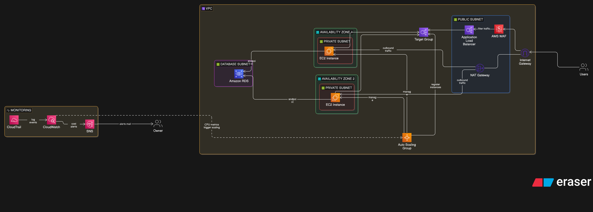

#  Resilient AWS Infrastructure with Terraform & CI/CD

##  Project Overview

This project demonstrates the design and deployment of a **resilient, scalable, and production-ready AWS infrastructure** using **Terraform (Infrastructure as Code)** and **GitHub Actions (CI/CD)**.

The architecture follows cloud best practices:

- High availability across multiple AZs

- Private/public subnet isolation

- Auto-scaling compute layer

- Managed database (RDS)

- Monitoring and alerting

- Secure remote state management

- CI/CD pipeline with approval workflow

---

##  Architecture

### Key Components

- **VPC** with public & private subnets

- **Application Load Balancer (ALB)** (internet-facing)

- **Auto Scaling Group (ASG)** with EC2 instances (private subnets)

- **RDS PostgreSQL** (private, non-public)

- **NAT Gateway** for outbound internet access

- **Security Groups** (least privilege)

- **CloudWatch + SNS** for monitoring and alerts

- **CloudTrail** for auditing

- **SSM Session Manager** (no SSH access required)

---

## 🐳 Containerization (Docker)

The application is containerized using Docker to ensure consistency, portability, and scalability across environments.

### Implementation

- Application packaged as a Docker image  
- Image stored in **Amazon ECR**  
- Deployed using:
  - EC2 Auto Scaling Group (initial setup)
  - ECS (container-based architecture)

### Benefits

- Immutable deployments  
- Consistent runtime environment  
- Simplified scaling and deployment  
- Alignment with cloud-native best practices  

---

## 🔐 Web Application Firewall (AWS WAF)

An AWS WAF Web ACL is deployed and attached to the Application Load Balancer to protect the application from Layer 7 attacks.

### Implemented Rules

- **AWSManagedRulesCommonRuleSet**  
  → Protects against common web attacks (SQL injection, XSS, malformed requests)

- **AWSManagedRulesKnownBadInputsRuleSet**  
  → Detects and blocks known malicious payload patterns

- **Rate-based rule**  
  → Limits requests per IP (100 requests / 5 minutes) to mitigate abusive traffic

### Validation

The WAF was tested using:

- Simulated application attacks (SQL injection, XSS)
- High-frequency request bursts

👉 Result:

- Malicious requests were successfully blocked  
- Abnormal traffic patterns were detected  
- Protection effectiveness confirmed via AWS WAF metrics  

##  Infrastructure as Code (Terraform)

The infrastructure is fully defined using Terraform:

- Modular and readable `.tf` files

- Variables for configuration

- Outputs for key resources

- Remote state with:

&#x20; - **S3 bucket (versioned, encrypted)**

&#x20; - **DynamoDB (state locking)**

### Example files:

- `vpc.tf`

- `alb.tf`

- `autoscaling.tf`

- `rds.tf`

- `security.tf`

- `monitoring.tf`

- `cloudtrail.tf`

---

##  Remote State & Locking

Terraform state is stored securely:

- **S3 bucket**

&#x20; - Versioning enabled

&#x20; - Server-side encryption

&#x20; - No public access

- **DynamoDB**

&#x20; - Prevents concurrent Terraform executions

&#x20; - Ensures consistency

---

##  CI/CD Pipeline (GitHub Actions)

A complete CI/CD pipeline is implemented:

###  Continuous Integration

On each push:

- `terraform fmt`

- `terraform validate`

- `terraform plan`

###  Controlled Deployment

- Manual approval required before deployment

- Uses GitHub **Environments (production)**

- After approval → `terraform apply`

###  Secrets Management

Sensitive values are stored in GitHub Secrets:

- AWS credentials

- Database password

- Alert email

---

##  Monitoring & Observability

- **CloudWatch metrics & alarms**

- **SNS notifications**

- **ALB health checks**

- Infrastructure visibility dashboard

---

##  Security Best Practices

- No SSH access → **SSM Session Manager**

- Private EC2 instances

- RDS not publicly accessible

- Strict Security Groups

- Encrypted state storage

- Secrets never stored in code

---

##  Example Output

After deployment:

- ALB DNS → public entry point

- Auto-scaled EC2 instances responding

- PostgreSQL database available internally

---

---

## 🔐 HTTPS (Not Implemented)

HTTPS is not implemented in this project.

### Reason

This infrastructure is designed as a **demonstration and validation environment**, and is not intended to be maintained long-term in production.

### Planned (if productionized)

- TLS certificates via AWS ACM  
- HTTPS listener on ALB  
- HTTP → HTTPS redirection  

👉 This would ensure encrypted communication between clients and the application.

##  Demo

Example response from the application:

##  What I Learned

- Designing resilient AWS architectures

- Writing production-ready Terraform code

- Managing Terraform state securely

- Implementing CI/CD pipelines for infrastructure

- Applying DevOps and cloud best practices

---

##  Author

Matteo –  Cloud & DevOps junior Engineer 

