# 🚀 Resilient Cloud-Native AWS Infrastructure (Terraform, ECS Fargate, WAF, CI/CD)


## 📌 Project Overview

This project demonstrates the design and deployment of a **resilient, scalable, and cloud-native AWS infrastructure** using **Terraform (Infrastructure as Code)** and **GitHub Actions (CI/CD)**.

The architecture follows modern cloud best practices:

- High availability across multiple AZs  
- Private/public subnet isolation  
- Containerized application (Docker)  
- Deployment using **ECS Fargate**  
- Image storage with **Amazon ECR**  
- Layer 7 protection using **AWS WAF**  
- Managed database (RDS)  
- Monitoring, alerting and auditing  

The project evolved from an EC2-based architecture to a **fully containerized deployment**, improving scalability and reducing operational overhead.


##  Architecture


### Key Components

- **VPC** with public & private subnets across 2 AZs  
- **Application Load Balancer (ALB)** (internet-facing)  
- **ECS Fargate** (containerized application in private subnets)  
- **Amazon ECR** (Docker image registry)  
- **RDS PostgreSQL** (private, single AZ)  
- **NAT Gateway** for outbound internet access  
- **Security Groups** (least privilege access)  
- **CloudWatch + SNS** for monitoring and alerting  
- **CloudTrail** for auditing  
- **AWS WAF** for Layer 7 protection  
- **SSM Session Manager** (no SSH access required)


---

## 🔄 Architecture Evolution

The initial version of the infrastructure was based on EC2 instances managed by an Auto Scaling Group.

- EC2 instances deployed in private subnets  
- Auto Scaling Group based on CPU utilization  
- ALB distributing traffic to EC2 instances  


### Auto scaling

Example response from the application:

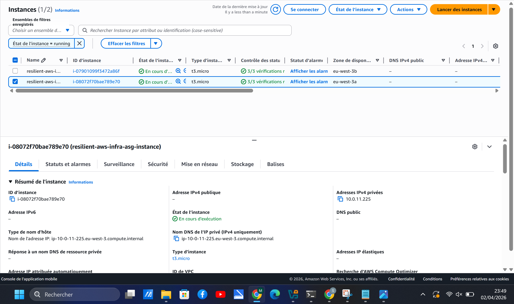

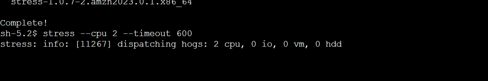

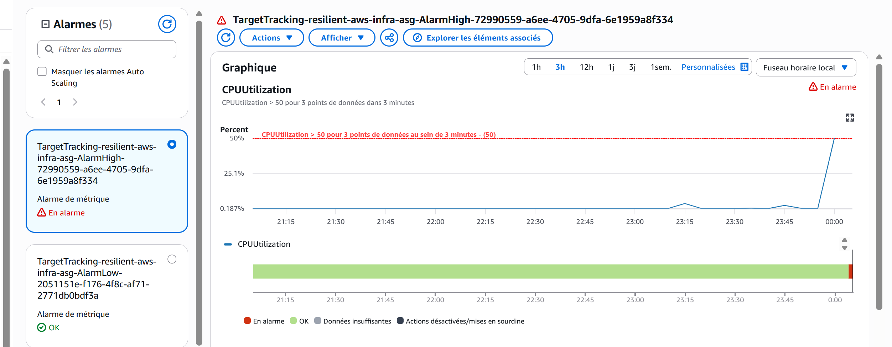

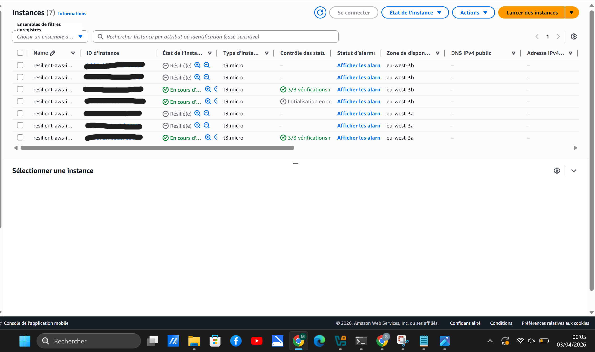

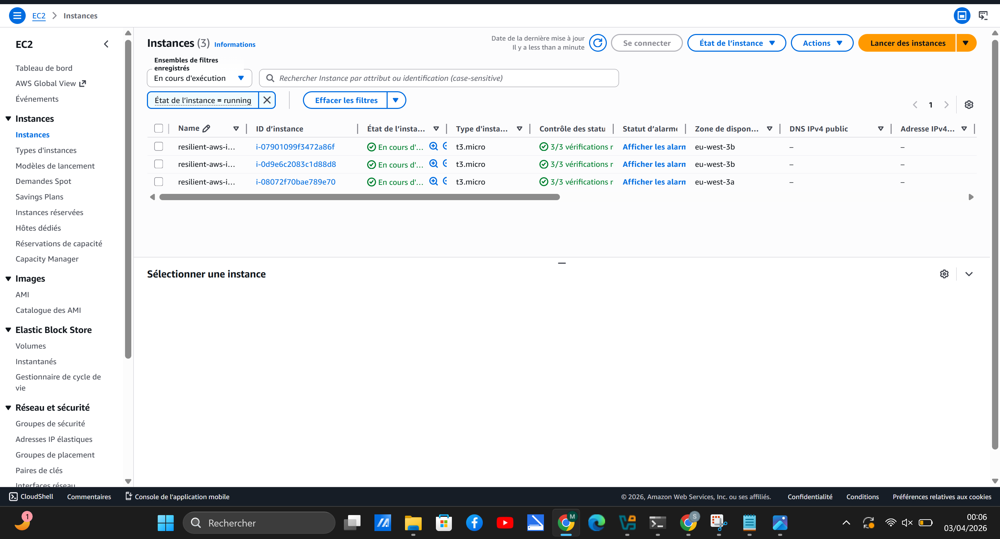

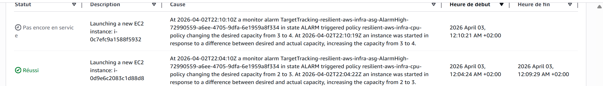


The architecture was later **migrated to ECS Fargate**:

- Containerized application (Docker)  
- Deployment via ECS Service  
- No server management required

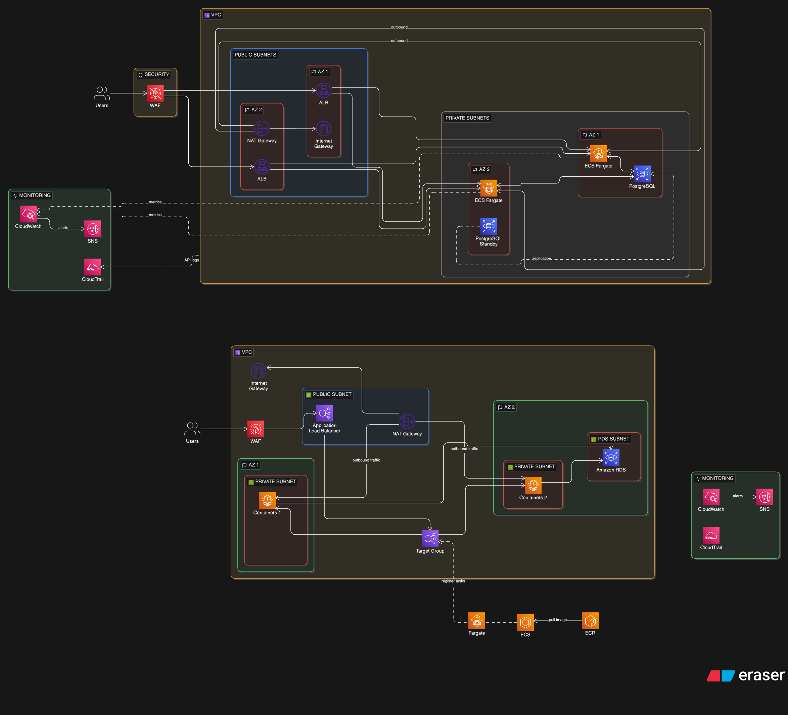


## 🔐 Web Application Firewall (AWS WAF)

An AWS WAF Web ACL is deployed and attached to the Application Load Balancer to protect the application from Layer 7 attacks.

### Implemented Rules

- **AWSManagedRulesCommonRuleSet**  
  → Protects against common web attacks (SQL injection, XSS, malformed requests)

- **AWSManagedRulesKnownBadInputsRuleSet**  
  → Detects and blocks known malicious payload patterns

- **Rate-based rule**  
  → Limits requests per IP (100 requests / 5 minutes) to mitigate abusive traffic

### Results

- I simulated application attacks (SQL injection, XSS)
- and High-frequency request bursts

###  High-frequency request bursts command (PowerShell) : 

It triggers 500 asynchronous web requests toward the Application Load Balancer (ALB).

```powershell
for ($i = 0; $i -lt 500; $i++) {
    Start-Job {
        Invoke-WebRequest -Uri "[http://resilient-aws-infra-alb-828325941.eu-west-3.elb.amazonaws.com](http://resilient-aws-infra-alb-828325941.eu-west-3.elb.amazonaws.com)" -UseBasicParsing | Out-Null
    }
}
```
- Abnormal traffic patterns were detected  

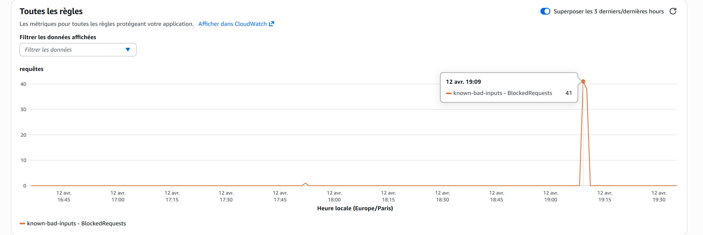

- Protection effectiveness confirmed via AWS WAF metrics

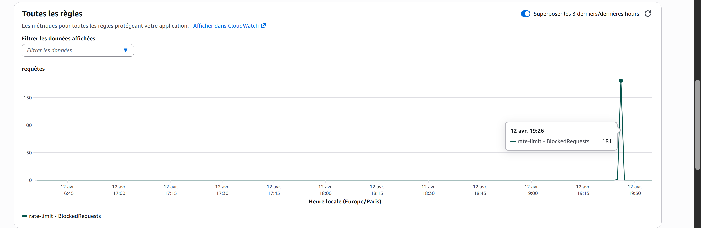

###  XSS attacks :   
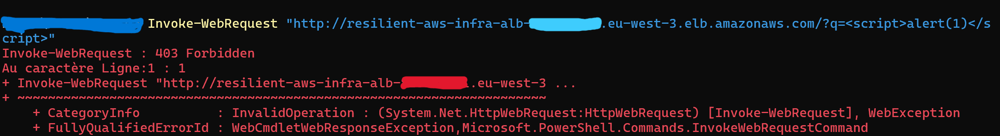

Malicious requests were successfully blocked : 

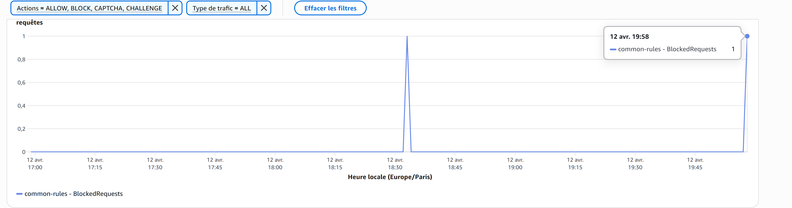


##  Infrastructure as Code (Terraform)


The infrastructure is fully defined using Terraform:


- Modular and readable `.tf` files

- Variables for configuration

- Outputs for key resources

- Remote state with:

&#x20; - **S3 bucket (versioned, encrypted)**

&#x20; - **DynamoDB (state locking)**


### Example files:

- `vpc.tf`

- `alb.tf`

- `autoscaling.tf`

- `rds.tf`

- `security.tf`

- `monitoring.tf`

- `cloudtrail.tf`


---


##  Remote State & Locking


Terraform state is stored securely:


- **S3 bucket**

&#x20; - Versioning enabled

&#x20; - Server-side encryption

&#x20; - No public access


- **DynamoDB**

&#x20; - Prevents concurrent Terraform executions

&#x20; - Ensures consistency


---


##  CI/CD Pipeline (GitHub Actions)


A complete CI/CD pipeline is implemented:


###  Continuous Integration


On each push:

- `terraform fmt`

- `terraform validate`

- `terraform plan`


###  Controlled Deployment


- Manual approval required before deployment

- Uses GitHub **Environments (production)**

- After approval → `terraform apply`


###  Secrets Management


Sensitive values are stored in GitHub Secrets:

- AWS credentials

- Database password

- Alert email


---


##  Monitoring & Observability


- **CloudWatch metrics & alarms**

- **SNS notifications**

- **ALB health checks**

- Infrastructure visibility dashboard


---


##  Security Best Practices


- No SSH access → **SSM Session Manager**

- Private EC2 instances

- RDS not publicly accessible

- Strict Security Groups

- Encrypted state storage

- Secrets never stored in code


---


---


---


## 🔐 HTTPS (Not Implemented)

HTTPS is not implemented in this project.

### Reason

This infrastructure is designed as a **demonstration and validation environment**, and is not intended to be maintained long-term in production.

### Planned (if productionized)

- TLS certificates via AWS ACM  
- HTTPS listener on ALB  
- HTTP → HTTPS redirection  

👉 This would ensure encrypted communication between clients and the application.


##  What I Learned


- Designing resilient AWS architectures

- Writing production-ready Terraform code

- Managing Terraform state securely

- Implementing CI/CD pipelines for infrastructure

- Applying DevOps and cloud best practices


---


##  Author


Matteo –  Cloud & DevOps junior Engineer 


