# 🚀 Resilient Cloud-Native AWS Infrastructure (Terraform, ECS Fargate, WAF, HTTPS, CI/CD)

[](https://www.terraform.io/)

[](https://opensource.org/licenses/MIT)

---

## 📖 Table of Contents

* [Project Overview](#-project-overview)
* [Architecture](#architecture)
    * [Key Components](#key-components)
* [Architecture Evolution](#-architecture-evolution)
    * [Initial architecture based on EC2](#initial-architecture-based-on-ec2)
    * [From EC2 to ECS Fargate](#the-architecture-was-later-migrated-to-ecs-fargate)
* [IAM](#iam)
* [CloudTrail](#cloudtrail)
* [Web Application Firewall (AWS WAF)](#-web-application-firewall-aws-waf)
    * [Implemented Rules](#implemented-rules)
    * [Attack Simulation Results](#results)
* [Infrastructure as Code (Terraform)](#%EF%B8%8F-infrastructure-as-code-terraform)
* [Remote State & Locking](#%EF%B8%8F-remote-state--locking)
* [CI/CD Pipeline (GitHub Actions)](#-cicd-pipeline-github-actions)
* [Monitoring & Observability](#-monitoring--observability)
* [Security Best Practices](#%EF%B8%8F-security-best-practices)
* [HTTPS](#-https)
* [What I Learned](#-what-i-learned)
* [Futur Improvement](#future-improvement)
* [Author](#%E2%80%8D-author)

---
## 📌 Project Overview

This project was built to deploy a simple web application on top of a resilient and secure AWS cloud infrastructure using **Terraform (Infrastructure as Code).

The architecture follows modern cloud and security best practices:

* High availability across multiple Availability Zones
* Network segmentation with public and private subnets
* Containerized application using Docker
* Deployment with **Amazon ECS Fargate** (serverless containers)
* Image storage with **Amazon ECR**
* Layer 7 protection using **AWS WAF**
* Managed database with **Amazon RDS (PostgreSQL)**
* Monitoring, alerting, and auditing using **CloudWatch, SNS, and CloudTrail**
* Secure communication over **HTTPS (ACM + ALB)**
* Secure access using **SSM Session Manager (no SSH exposure)**
* **Secure CI/CD authentication using GitHub OIDC with AWS IAM roles**, eliminating static credentials
* Secrets managed securely via **GitHub Actions Secrets** (with potential improvement using AWS Secrets Manager)

The project initially relied on an EC2-based architecture and was later migrated to a **fully containerized deployment using ECS Fargate**

---

## 🏗️ Architecture

### Key Components

* **VPC** with public and private subnets across two Availability Zones
* **Application Load Balancer (ALB)** (internet-facing) handling HTTPS traffic
* **ECS Fargate** running containerized workloads in private subnets
* **Amazon ECR** as a private Docker registry
* **Amazon RDS (PostgreSQL)** deployed in a private subnet
* **NAT Gateway** enabling outbound internet access for private resources
* **Security Groups** enforcing least-privilege network access
* **CloudWatch + SNS** for monitoring and alerting
* **CloudTrail** for API activity logging and auditing
* **AWS WAF** protecting the application at Layer 7
* **SSM Session Manager** for secure instance access without SSH
* **ACM (AWS Certificate Manager)** for TLS/HTTPS encryption

---

## 🔄 Architecture Evolution

## Initial architecture based on EC2 

The first version of the infrastructure was built on **EC2 instances managed by an Auto Scaling Group**, before being later migrated to containers.

### Why EC2 initially?

As a first design choice, I wanted to host a web application directly on EC2 instances using **Nginx** as the web server.

Nginx was installed on each instance to serve the application, while the architecture was designed around two main objectives:

Architecture overview:

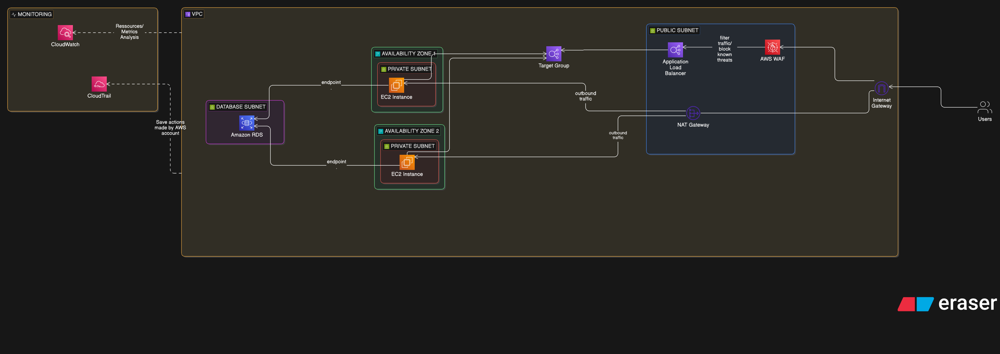


## Security and resilience
To secure and harden the infrastructure:

- EC2 instances were deployed in **private subnets**, reducing direct exposure to the Internet  
- An **Application Load Balancer (ALB)** acted as the single public entry point and distributed traffic across instances  
- Multi-AZ deployment improved availability and fault tolerance  

### Secure Access with AWS Systems Manager (SSM)

Instead of using SSH for instance access, AWS Systems Manager (SSM) was configured.

**Traditional SSH access requires:**

exposing instances to the Internet via a public IP address
opening port 22, which increases the attack surface

**By using SSM:**

Instances can remain in private subnets with no public IP
no inbound ports (including SSH) need to be opened
access is performed securely through the AWS control plane

To connect to an instance, I interact with the SSM service, which communicates with the SSM Agent running on the instance


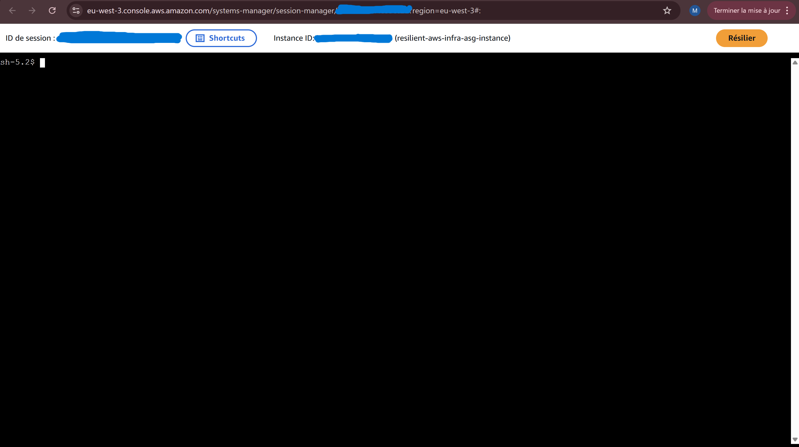

---

## The architecture was later **migrated to ECS Fargate**


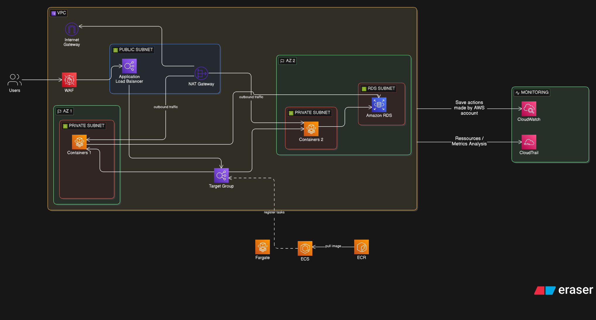

### Why migrate from EC2 to containers?

I chose to move from EC2-based workloads to containers running on **ECS Fargate** for several reasons.

### 1. Simplicity and operational efficiency
Because the application is a lightweight static web application, full control over operating system resources providing by running dedicated virtual machines was unnecessary. 

Using **Fargate** allowed me to focus on the application rather than managing servers, patching hosts, or handling capacity planning.

---

### 2. Cost efficiency
For this workload, **ECS Fargate proved more cost-effective than maintaining EC2 instances**, especially for a small application with moderate and predictable usage.

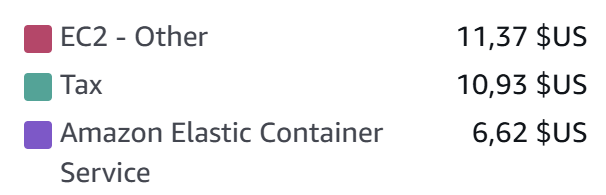

---

### 3. Container portability and faster deployments
Containers also provide:
- Reproducible deployments  
- Portable workloads  
- Faster updates and rollouts  
- Simplified application lifecycle management  

Because the application is packaged as a Docker image, **updates can be deployed rapidly** by pushing a new image to **ECR** and triggering a new deployment in **ECS**.

---

## Deployment update demonstration

The screenshots below show a simple application update workflow:
1. Initial ECS service state  
2. Initial web page deployed  
3. HTML modification  
4. ECS rolling deployment reaction  
5. Updated content visible in production  

Initial ECS state:

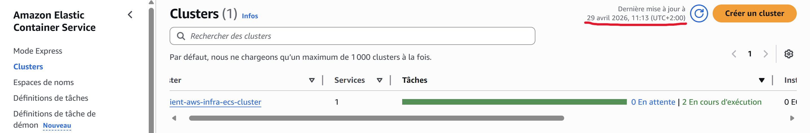

Initial application:

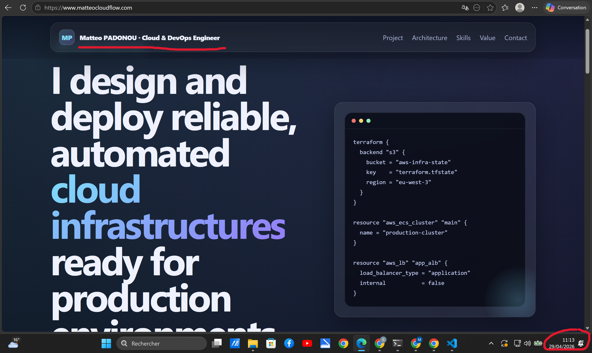

Application update:

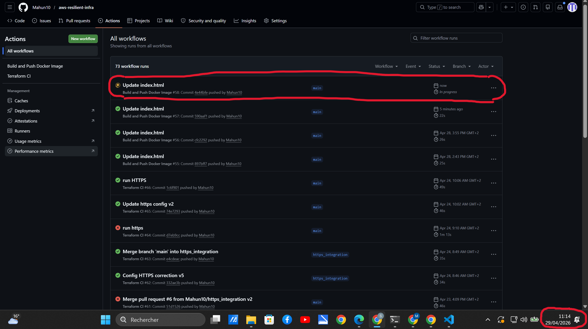

Rolling deployment:

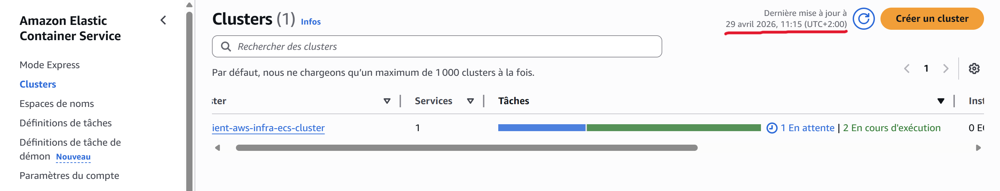

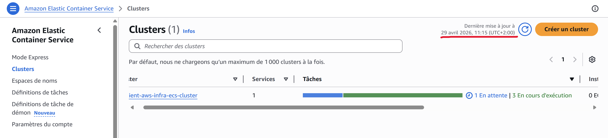

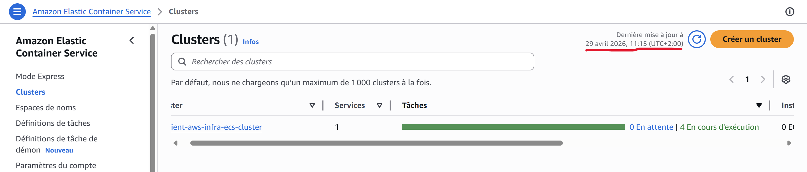

Updated application in production:

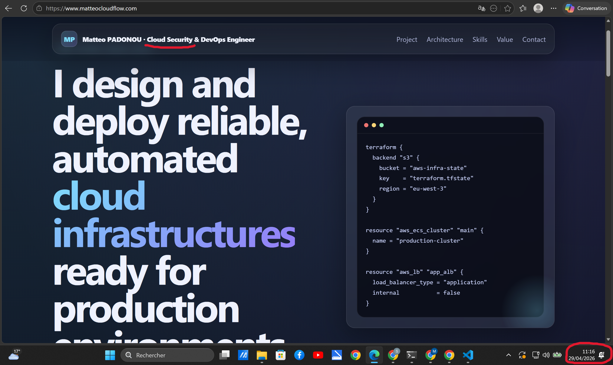

## 🚨 IAM

I configured dedicated IAM identities for different use cases:

- A Terraform identity used to provision and manage the infrastructure
- An identity dedicated to building and pushing Docker images to Amazon ECR

Each identity follows the principle of least privilege, ensuring that only the permissions strictly required for its function are granted.

In addition, I implemented GitHub OIDC integration with AWS IAM roles, eliminating the need for static credentials and improving the overall security of the CI/CD pipeline by using temporary, short-lived access tokens.

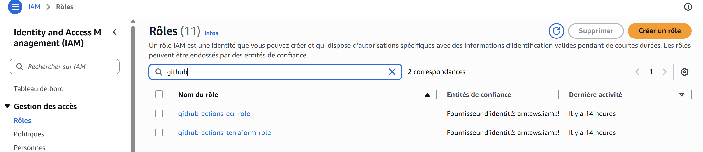

## 📈 CloudTrail

CloudTrail was configured to monitor and log all API activity across the AWS environment.

In this project, it allows:

tracking who performed actions on the infrastructure (e.g., resource creation, modification, or deletion)
detecting configuration changes within the VPC and associated services

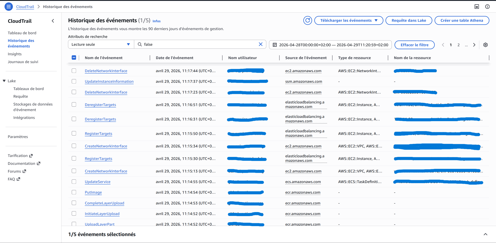


## 🧱 Web Application Firewall (AWS WAF)

An AWS WAF Web ACL was deployed and attached to the Application Load Balancer to protect the application from Layer 7 attacks.

### Implemented Rules

- **AWSManagedRulesCommonRuleSet**  
  → Protects against common web attacks (SQL injection, XSS, malformed requests)

- **AWSManagedRulesKnownBadInputsRuleSet**  
  → Detects and blocks known malicious payload patterns

- **Rate-based rule**  
  → Limits requests per IP (100 requests / 5 minutes) to mitigate abusive traffic

### Results

- I simulated application attacks (SQL injection, XSS)
- and High-frequency request bursts

###  High-frequency request bursts command (PowerShell) : 

It triggers 500 asynchronous web requests toward the Application Load Balancer (ALB).

```powershell
for ($i = 0; $i -lt 500; $i++) {
    Start-Job {
        Invoke-WebRequest -Uri "[http://resilient-aws-infra-alb-xxxxxxxx.eu-west-3.elb.amazonaws.com](http://resilient-aws-infra-alb-xxxxxx.eu-west-3.elb.amazonaws.com)" -UseBasicParsing | Out-Null
    }
}
```
- Abnormal traffic patterns were detected  

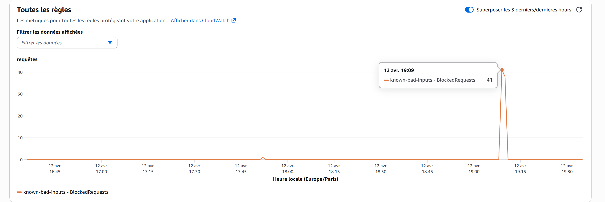

- Protection effectiveness confirmed via AWS WAF metrics

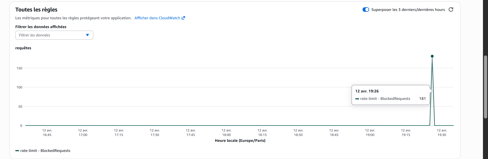

###  XSS attacks :   
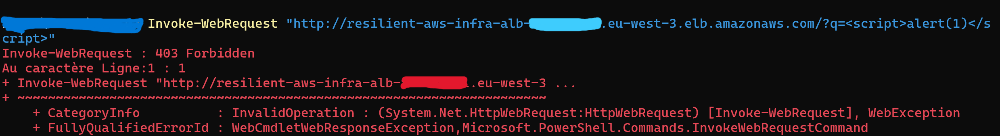

Malicious requests were successfully blocked : 

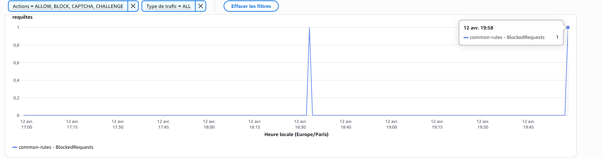


## 🛠️ Infrastructure as Code (Terraform)


The infrastructure is fully defined using Terraform:


- Modular and readable `.tf` files

- Variables for configuration

- Outputs for key resources

- Remote state with:

&#x20; - **S3 bucket (versioned, encrypted)**

&#x20; - **DynamoDB (state locking)**


### Example files:

- `vpc.tf`

- `alb.tf`

- `autoscaling.tf`

- `rds.tf`

- `security.tf`

- `monitoring.tf`

- `cloudtrail.tf`


---


## ☁️ Remote State & Locking


Terraform state is stored securely:


- **S3 bucket**

&#x20; - Versioning enabled

&#x20; - Server-side encryption

&#x20; - No public access


- **DynamoDB**

&#x20; - Prevents concurrent Terraform executions

&#x20; - Ensures consistency


---


## 🚀 CI/CD Pipeline (GitHub Actions)


A complete CI/CD pipeline is implemented:


###  Continuous Integration


On each push:

- `terraform fmt`

- `terraform validate`

- `terraform plan`


###  Controlled Deployment


- Manual approval required before deployment

- Uses GitHub **Environments (production)**

- After approval → `terraform apply`


###  Secrets Management


Sensitive variables such as database credentials and alert endpoints are injected at runtime using GitHub Secrets, avoiding hardcoding in the source code.


---


## 📊 Monitoring & Observability


- **CloudWatch metrics & alarms**

- **SNS notifications**

- **ALB health checks**

- Infrastructure visibility dashboard


---


## 🛡️ Security Best Practices

The infrastructure implements several security best practices:

* **No SSH access** → Instances are accessed securely using **SSM Session Manager**, eliminating the need for public IPs and open ports
* **Private compute resources** → EC2 instances and ECS tasks run in private subnets, reducing exposure to the internet
* **Database isolation** → The RDS instance is deployed in a private subnet and is not publicly accessible
* **Network security** → Security Groups enforce strict, least-privilege inbound and outbound rules
* **Encrypted Terraform state** → Infrastructure state is securely stored in an encrypted S3 bucket
* **Secrets management** → Sensitive data (e.g., database credentials, alerting endpoints) is injected at runtime via GitHub Secrets, avoiding hardcoding in the source code
* **Audit and monitoring** → CloudTrail logs all API activity, while CloudWatch and SNS provide real-time monitoring and alerting
* **Application protection** → AWS WAF provides Layer 7 protection against common web attacks
* **Secure CI/CD authentication** → Implemented **GitHub OIDC integration with AWS IAM roles** for both Terraform and Docker pipelines, eliminating static AWS credentials and enforcing short-lived, least-privilege access

---

## 🔐 HTTPS

HTTPS has been implemented in this project.

### Implementation

- TLS certificate provisioned with AWS Certificate Manager (ACM)
- DNS validation configured through Cloudflare
- HTTPS listener configured on the Application Load Balancer
- HTTP traffic redirected automatically to HTTPS
- Public access available through `www.matteocloudflow.com`

### Important

The live application is no longer publicly accessible because the AWS infrastructure was intentionally decommissioned after validation to avoid ongoing cloud costs.

Screenshots of the live HTTPS deployment is included below as evidence that the infrastructure was successfully deployed, tested, and functional.


### Result


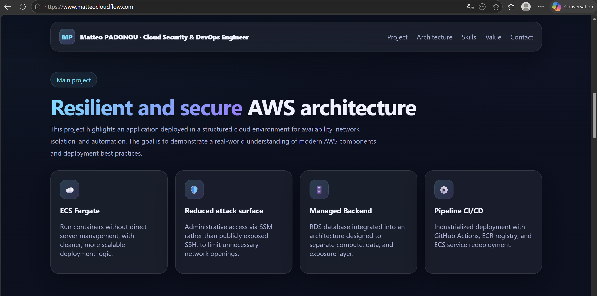

The application is accessible securely over HTTPS, with TLS termination handled by the Application Load Balancer.

## 🎓 What I Learned


- Designing resilient AWS architectures

- Writing production-ready Terraform code

- Managing Terraform state securely

- Implementing CI/CD pipelines for infrastructure

- Applying DevOps and cloud best practices


## Futur Improvement
Implement ECS Service Auto Scaling based on users'requests


---


## 👨‍💻 Author
 


Matteo PADONOU –  Cloud Security & DevOps junior Engineer 


