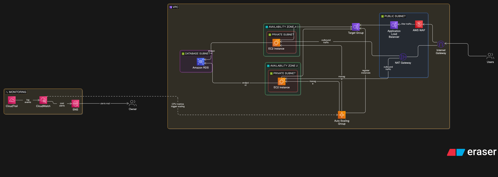
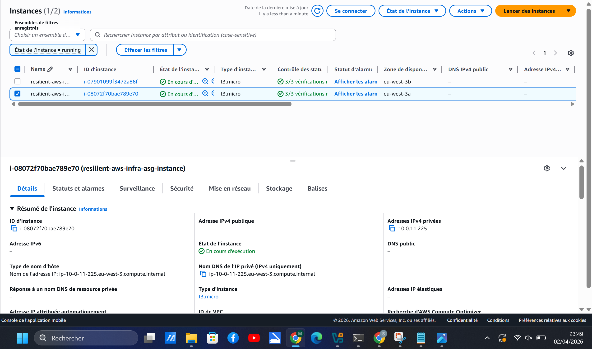
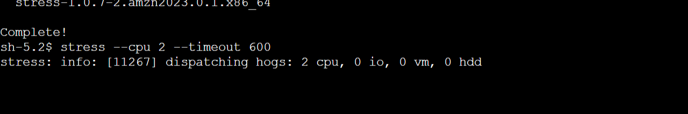
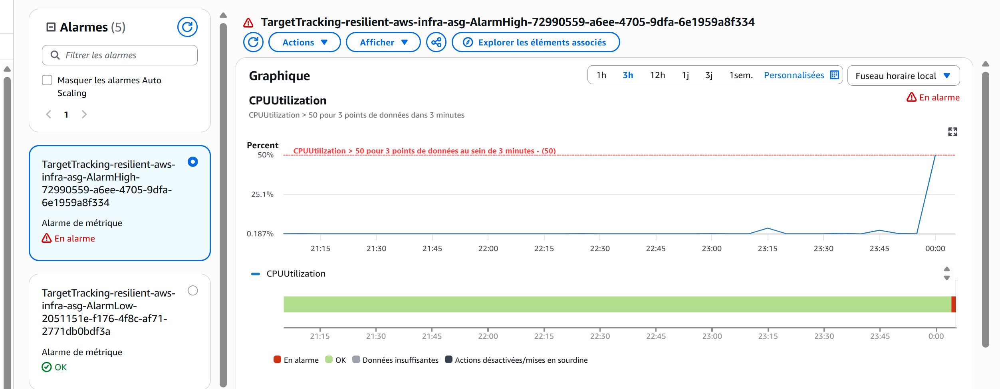
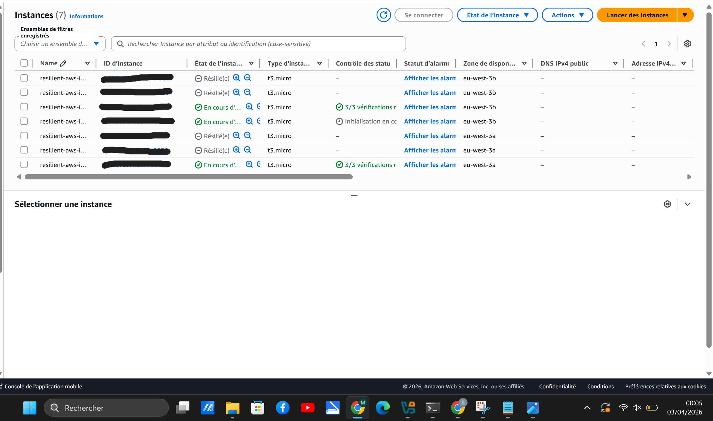
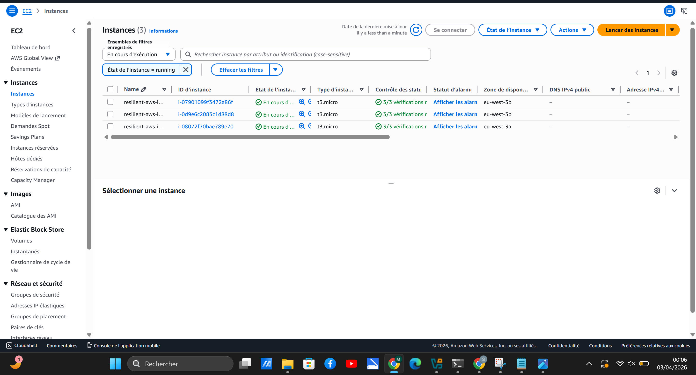
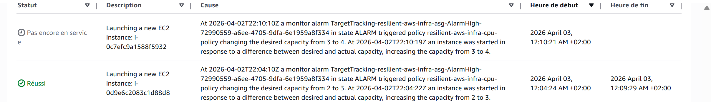
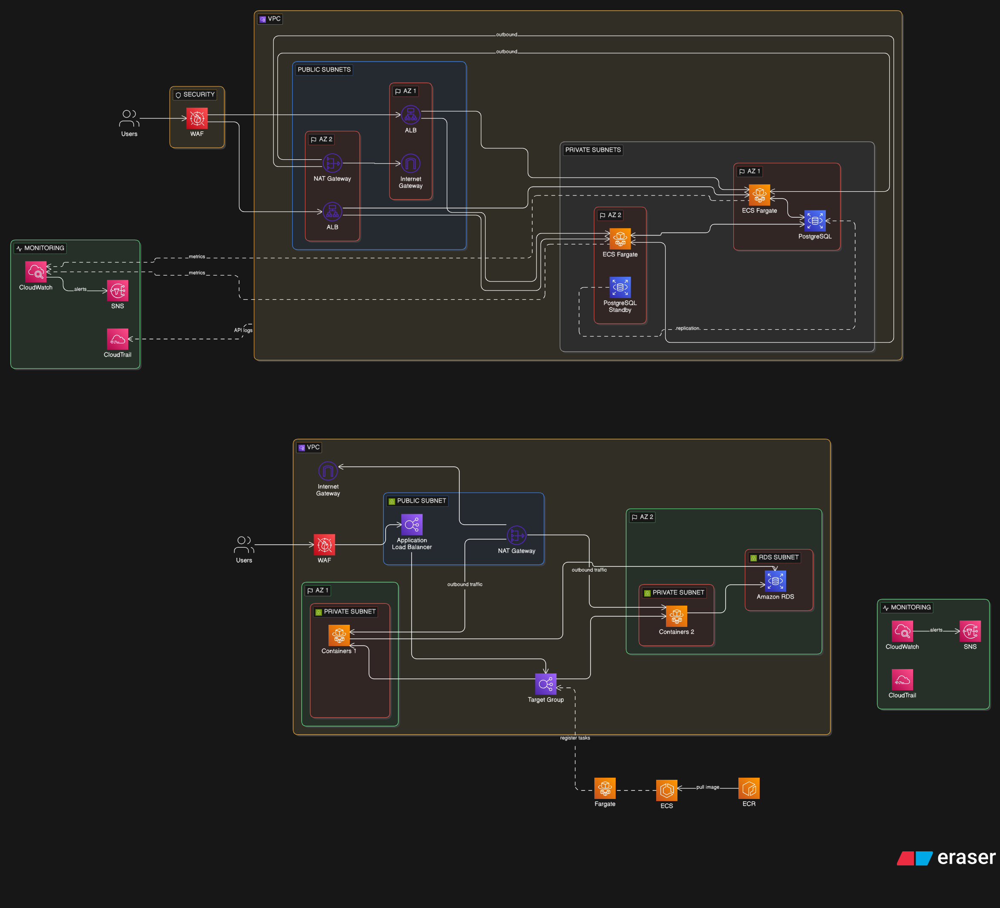

# 🚀 Resilient Cloud-Native AWS Infrastructure (Terraform, ECS Fargate, WAF, HTTPS, CI/CD)

[](https://www.terraform.io/)

[](https://opensource.org/licenses/MIT)

---

## 📖 Table of Contents

* [Project Overview](#-project-overview)
* [Architecture](#architecture)
    * [Key Components](#key-components)
* [Architecture Evolution](#-architecture-evolution)
    * [Auto Scaling & Stress Tests](#auto-scaling)
    * [Migration to ECS Fargate](#the-architecture-was-later-migrated-to-ecs-fargate)
* [Web Application Firewall (AWS WAF)](#-web-application-firewall-aws-waf)
    * [Implemented Rules](#implemented-rules)
    * [Attack Simulation Results](#results)
* [Infrastructure as Code (Terraform)](#%EF%B8%8F-infrastructure-as-code-terraform)
* [Remote State & Locking](#%EF%B8%8F-remote-state--locking)
* [CI/CD Pipeline (GitHub Actions)](#-cicd-pipeline-github-actions)
* [Monitoring & Observability](#-monitoring--observability)
* [Security Best Practices](#%EF%B8%8F-security-best-practices)
* [HTTPS](#-https)
* [What I Learned](#-what-i-learned)
* [Futur Improvement](#future-improvement)
* [Author](#%E2%80%8D-author)

---

## 📌 Project Overview

This project demonstrates the design and deployment of a **resilient, scalable, and cloud-native AWS infrastructure** using **Terraform (Infrastructure as Code)** and **GitHub Actions (CI/CD)**.

The architecture follows modern cloud best practices:

- High availability across multiple AZs  
- Private/public subnet isolation  
- Containerized application (Docker)  
- Deployment using **ECS Fargate**  
- Image storage with **Amazon ECR**  
- Layer 7 protection using **AWS WAF**  
- Managed database (RDS)  
- Monitoring, alerting and auditing
- HTTPS 

The project evolved from an EC2-based architecture to a **fully containerized deployment**, improving scalability and reducing operational overhead.


## 🏗️ Architecture


### Key Components

- **VPC** with public & private subnets across 2 AZs  
- **Application Load Balancer (ALB)** (internet-facing)  
- **ECS Fargate** (containerized application in private subnets)  
- **Amazon ECR** (Docker image registry)  
- **RDS PostgreSQL** (private, single AZ)  
- **NAT Gateway** for outbound internet access  
- **Security Groups** (least privilege access)  
- **CloudWatch + SNS** for monitoring and alerting  
- **CloudTrail** for auditing  
- **AWS WAF** for Layer 7 protection  
- **SSM Session Manager** (no SSH access required)
- **HTTPS**


---

## 🔄 Architecture Evolution

The initial version of the infrastructure was based on EC2 instances managed by an Auto Scaling Group.

- EC2 instances deployed in private subnets  
- Auto Scaling Group based on CPU utilization  
- ALB distributing traffic to EC2 instances




### Auto scaling

Initially, the infrastructure runs with two instances.




To simulate high traffic and CPU consumption, we used the command `stress --cpu 2 --timeout 600`.

This command launches two CPU worker threads (`--cpu 2`) in order to generate processor load for 600 seconds (`--timeout 600`), which corresponds to 10 minutes.




At the same time, CPU utilization can be monitored in real time through Amazon CloudWatch.

Once CPU utilization exceeds the configured threshold of 50%, the auto scaling policy is triggered and new instances begin to launch automatically.







The service indicates that the scaling operation succeeded and increases the number of running instances from 2 to 4 in order to handle the additional load.




## The architecture was later **migrated to ECS Fargate**




### Why migrate from EC2 to containers?

I chose to move from EC2-based workloads to containers running on **ECS Fargate** for several reasons.

### 1. Simplicity and operational efficiency
Because the application is a lightweight static web application, running dedicated virtual machines was unnecessary. Full control over operating system resources was not required for this use case, and advanced host-level integrations (such as SIEM agents or custom OS hardening) were outside the project scope.

Using **Fargate** allowed me to focus on the application rather than managing servers, patching hosts, or handling capacity planning.

---

### 2. Cost efficiency
For this workload, **ECS Fargate proved more cost-effective than maintaining EC2 instances**, especially for a small application with moderate and predictable usage.


---

### 3. Container portability and faster deployments
Containers also provide:
- Reproducible deployments  
- Portable workloads  
- Faster updates and rollouts  
- Simplified application lifecycle management  

Because the application is packaged as a Docker image, *updates can be deployed rapidly* by pushing a new image to **ECR** and triggering a new deployment in **ECS**.

---

## Deployment update demonstration

The screenshots below show a simple application update workflow:
1. Initial ECS service state  
2. Initial web page deployed  
3. HTML modification  
4. ECS rolling deployment reaction  
5. Updated content visible in production  

Initial ECS state:


Initial application:


Application update:


Rolling deployment:


Updated application in production:


## 🧱 Web Application Firewall (AWS WAF)

An AWS WAF Web ACL is deployed and attached to the Application Load Balancer to protect the application from Layer 7 attacks.

### Implemented Rules

- **AWSManagedRulesCommonRuleSet**  
  → Protects against common web attacks (SQL injection, XSS, malformed requests)

- **AWSManagedRulesKnownBadInputsRuleSet**  
  → Detects and blocks known malicious payload patterns

- **Rate-based rule**  
  → Limits requests per IP (100 requests / 5 minutes) to mitigate abusive traffic

### Results

- I simulated application attacks (SQL injection, XSS)
- and High-frequency request bursts

###  High-frequency request bursts command (PowerShell) : 

It triggers 500 asynchronous web requests toward the Application Load Balancer (ALB).

```powershell
for ($i = 0; $i -lt 500; $i++) {
    Start-Job {
        Invoke-WebRequest -Uri "[http://resilient-aws-infra-alb-xxxxxxxx.eu-west-3.elb.amazonaws.com](http://resilient-aws-infra-alb-xxxxxx.eu-west-3.elb.amazonaws.com)" -UseBasicParsing | Out-Null
    }
}
```
- Abnormal traffic patterns were detected  


- Protection effectiveness confirmed via AWS WAF metrics


###  XSS attacks :   


Malicious requests were successfully blocked : 


## 🛠️ Infrastructure as Code (Terraform)


The infrastructure is fully defined using Terraform:


- Modular and readable `.tf` files

- Variables for configuration

- Outputs for key resources

- Remote state with:

&#x20; - **S3 bucket (versioned, encrypted)**

&#x20; - **DynamoDB (state locking)**


### Example files:

- `vpc.tf`

- `alb.tf`

- `autoscaling.tf`

- `rds.tf`

- `security.tf`

- `monitoring.tf`

- `cloudtrail.tf`


---


## ☁️ Remote State & Locking


Terraform state is stored securely:


- **S3 bucket**

&#x20; - Versioning enabled

&#x20; - Server-side encryption

&#x20; - No public access


- **DynamoDB**

&#x20; - Prevents concurrent Terraform executions

&#x20; - Ensures consistency


---


## 🚀 CI/CD Pipeline (GitHub Actions)


A complete CI/CD pipeline is implemented:


###  Continuous Integration


On each push:

- `terraform fmt`

- `terraform validate`

- `terraform plan`


###  Controlled Deployment


- Manual approval required before deployment

- Uses GitHub **Environments (production)**

- After approval → `terraform apply`


###  Secrets Management


Sensitive values are stored in GitHub Secrets:

- AWS credentials

- Database password

- Alert email


---


## 📊 Monitoring & Observability


- **CloudWatch metrics & alarms**

- **SNS notifications**

- **ALB health checks**

- Infrastructure visibility dashboard


---


## 🛡️ Security Best Practices


- No SSH access → **SSM Session Manager**

- Private EC2 instances

- RDS not publicly accessible

- Strict Security Groups

- Encrypted state storage

- Secrets never stored in code

---

## 🔐 HTTPS

HTTPS has been implemented in this project.

### Implementation

- TLS certificate provisioned with AWS Certificate Manager (ACM)
- DNS validation configured through Cloudflare
- HTTPS listener configured on the Application Load Balancer
- HTTP traffic redirected automatically to HTTPS
- Public access available through `www.matteocloudflow.com`

### Important

The live application is no longer publicly accessible because the AWS infrastructure was intentionally decommissioned after validation to avoid ongoing cloud costs.

Screenshots of the live HTTPS deployment is included below as evidence that the infrastructure was successfully deployed, tested, and functional.


### Result


The application is accessible securely over HTTPS, with TLS termination handled by the Application Load Balancer.

## 🎓 What I Learned


- Designing resilient AWS architectures

- Writing production-ready Terraform code

- Managing Terraform state securely

- Implementing CI/CD pipelines for infrastructure

- Applying DevOps and cloud best practices


## Futur Improvement
Implement ECS Service Auto Scaling based on CPU and memory utilization


---


## 👨‍💻 Author
 


Matteo PADONOU –  Cloud & DevOps junior Engineer 


